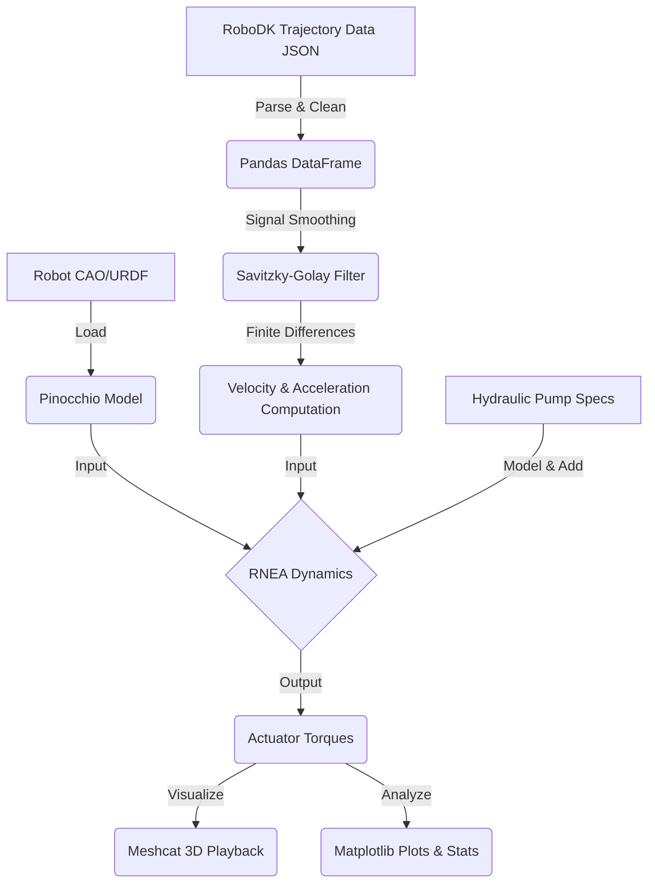

# GIT Manipulator: Inverse Dynamics & Torque Simulation

[](https://www.python.org/)
[](https://github.com/stack-of-tasks/pinocchio)
[](https://robodk.com/)

This project implements a complete pipeline for **inverse dynamics simulation** and **actuator torque analysis** for the "GIT" robot manipulator. It bridges the gap between conceptual robotic design (URDF/CAO) and practical hardware validation, such as motor sizing and structural analysis.

The simulation computes the required joint torques ($\tau$) for a given trajectory, accounting for inertial properties, gravity, complex external factors like hydraulic pumps, and trajectory signal noise.

---

## Key Engineering Features

1.  **Kinematic & Dynamic Modeling:** Loads and processes the robot's physical properties (mass, inertia, geometry) from a standard **URDF** model (`GIT_CAO`).
2.  **RoboDK Integration:** Seamlessly parses real-world joint trajectory data exported from **RoboDK** simulation software in JSON format.
3.  **Advanced Signal Processing:** Applies a **Savitzky-Golay filter** to the raw position data to obtain clean, differentiable velocity and acceleration profiles from noisy positional inputs.
4.  **Inverse Dynamics via RNEA:** Utilizes the state-of-the-art **Recursive Newton-Euler Algorithm (RNEA)**, implemented through the Pinocchio library, to compute the required torques at each joint.
5.  **Hardware Specifics Modeling:** Features custom torque compensation to account for the dynamic effects of a hydraulic pump mounted on the second joint.
6.  **Full System Visualization:** Provides an interactive 3D playback of the simulation using the web-based **Meshcat** viewer.
7.  **Automated Statistical Analysis:** Generates Matplotlib plots of torque evolution over time and computes key statistics (Mean, Min, Max Torque) per joint for performance validation.

---

## The Technical Pipeline

The workflow implemented in the Jupyter Notebook is as follows:



---

## Prerequisites & Installation

To run this simulation, you will need Python 3.x installed along with the following libraries:

* **pinocchio:** Fast rigid body dynamics library.
* **meshcat:** Web-based 3D visualizer.
* **pandas & numpy:** Data manipulation and numerical computing.
* **matplotlib:** Plotting and visualization.
* **scipy:** Used for the Savitzky-Golay signal filtering.

You can install the main dependencies using pip:

```bash
pip install meshcat pandas numpy matplotlib scipy
```

> **Note:** For `pinocchio`, please refer to the [official installation guide](https://stack-of-tasks.github.io/pinocchio/download.html) as it may require specific package managers like Conda or APT depending on your operating system.

---

## Usage

1.  **Prepare your data:** Ensure your RoboDK trajectory file (e.g., `Simu_Lifting_GIT.json`) and the `GIT_CAO` folder are in the project directory.
2.  **Run the Notebook:** Launch Jupyter Notebook and open `Simulation_Dynamique_GIT.ipynb`.
3.  **Execute:** Run all cells sequentially to process the data, start the Meshcat server, and generate torque analysis plots.

---

## Results and Analysis

The simulation provides a detailed torque analysis for each joint. This is used to validate actuator selection and ensure the robot can perform the required maneuvers under dynamic loads.

* **3D Visualization:** Using Meshcat, the trajectory is replayed in a browser, allowing for visual movement validation.
* **Torque Profiles:** The script generates plots showing the evolution of torque (N.m) over time for every axis, including the impact of the hydraulic compensation.

---

## Author

**BOUCHAUD Sam** - *Mechanical & Robotics Engineer* - [LinkedIn](Lien_vers_ton_profil_ici) 

---

## 📄 License

This project is licensed under the MIT License.
